# GNN Introduction

## 摘要

​	近年来，从图像分类和视频处理到语音识别和自然语言理解都是深度学习任务，这些任务中的数据通常在欧几里得空间中表示。然而，有越来越多的应用，数据产生于非欧几里得领域，并被表示为具有复杂关系和对象间相互依赖的图，图数据的复杂性给现有的机器学习算法带来了巨大的挑战。图神经网络的出现给处理非欧数据带来了曙光，近年来，图神经网络的变种，如图卷积网络（GCN）、图注意网络（GAT）、图递归网络（GRN）在许多深度学习任务上表现出突破性的性能。而图卷积神经网络作为图神经网络的基石，近几年在很多领域取得了亮眼的成绩。本文概括了基于谱域和基于空域的两种图卷积神经网络的发展历程，最后总结讨论了图神经网络与网络科学结合的可能性。
关键词: 深度学习，网络科学，图神经网络（GNNs），图卷积网络（GCNs），图注意网络（GAT），图递归网络（GRN），复杂网络模型。

## 1. 引入

​	深度神经网络的出现成功推动了模式识别和数据挖掘的研究，许多曾经严重依赖手工制作的特征工程来提取信息特征集的机器学习任务，如物体检测[1]，[2]，机器翻译[3]，[4]和语音识别[5]，近来已经被各种端到端的深度学习范式彻底改变，例如卷积神经网络(Convolutional Neural Networks)[6]，循环神经网络(Recurrent Neural Networks)[7]和自动编码器(Auto Encoder)[8]。

​	深度学习在许多领域的成功归功于快速发展的计算资源（如GPU）、大量训练数据的可用性，以及深度学习从欧式空间数据（如图像、文本和视频）中提取潜在表征的有效性。以图像数据为例，CNN能够利用图像数据的平移结构不变性和局部连通性[9]，可以将图像表示为欧氏空间中的一个规则网格。因此，CNN可以提取与整个数据集共享的局部有意义的特征，用于各种图像分析。

​	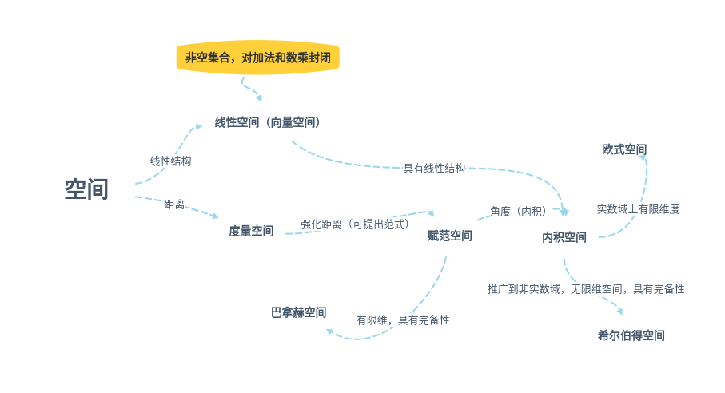

***图1-1 几何学中的空间定义***

​	在平面几何学中，位置是空间的第一原始概念，空间本身其实就是全集之中所有位置的总体。在几何学中，通常用点来标记位置， 所以点其实就是位置的抽象化。当一个动点由一个位置移动到另一位置，其所经过的点组成这个运动的通路。连结于空间各地之间的通路，则是空间中第二个原始概念。在线性空间中，向量之间的基本运算为线性运算，其具体模型为几何空间。欧氏空间[10],[11]则是特殊的线性空间，而线性空间中的向量对应于欧几里得平面中的点，在线性空间中的加法运算对应于欧几里得空间中的平移。欧式空间就是在对现实空间的规则抽象和推广（从n<=3推广到有限n维空间）。在欧式空间中，平行线任何位置的间距相等。欧式空间是一个有内积的线性空间，引入内积的目的是为了能够计算两点间的距离和夹角。现在我们处理的大多数据都是欧几里得数据，如图像、文本、音频，这些数据有一个特点就是：“排列整齐”。如图像数据，节点和邻居节点有着统计上的相关性，因此能够找出邻居节点。这类型的数据排列整齐，不同样本之间可以容易的定义出“距离”这个概念出来，意味着可以很容易地定义出卷积这个操作出来，并且在深度网络中进行进一步操作。假设现在有两个图片样本，尽管其图片大小可能不一致，但是总是可以通过空间下采样的方式将其统一到同一个尺寸的，然后直接逐个像素点进行相减后取得平方和，求得两个样本之间的欧几里德距离是完全可以进行的。

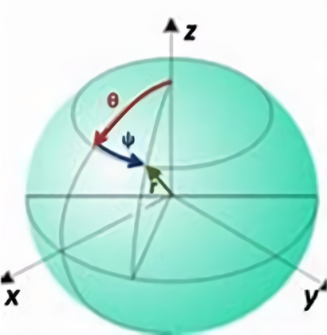

***图 1-2 球面绘圆***

​	与欧氏空间不同，非欧空间[12]的面是曲面，它与我们常见的平面从视觉感观上有很大的不同。非欧几何，爱因斯坦曾经形象地说明过：假定存在一种二维扁平智能生物，但它们不是生活在绝对的平面上，而是生活在一个球面上，那么，当它们在小范围研究圆周率的时候，会跟我们一样发现圆周率是π。可是，如果它们画一个很大的圆，去测量圆的周长和半径，就会发现周长小于2πr，圆越大，周长比2πr小得越多，为了能够适用于大范围的研究，它们就必须修正它们的几何方法。如果空间有四维，而我们生活在三维空间中，而这个三维空间在空间的第四个维度中发生了弯曲，我们的几何就会象那个球面上的扁平智能生物一样，感受不到第四维的存在，但我们的几何必须进行修正，这就是非欧几何。在非欧几何中，平行的直线只在局部平行，就像地球的经线只在赤道上平行。图结构数据和流式数据有个特点就是，排列不整齐。具体体现在：对于数据中的某个点，难以定义出其邻居节点出来，或者是不同节点的邻居节点的数量是不同的。这样就意味着难以在这类型的数据上定义出和图像等数据上相同的卷积操作出来，而且因为每个样本的节点排列可能都不同。也即不能像欧式空间中通过内积来获得来个结点之间的距离和夹角。

​	虽然深度学习有效地捕捉了欧几里得数据的潜在表示，但有越来越多的应用，其中数据是以图的形式表示的。例如，在电子商务中，基于图的学习系统可以利用用户和产品之间的相互作用来做出高度准确的推荐。在化学与材料中，分子被建模为图，它们的生物活性需要被识别以用于药物发现。在引文网络中，文章通过引文关系相互连接，它们需要被归类为不同的组。图数据的复杂性给现有的机器学习算法带来了巨大的挑战。由于图可能是不规则的，一个图可能有大小不一的无序节点，而且来自一个图的节点可能有不同数量的邻居，导致一些重要的操作（如卷积）在图像领域容易计算，但在图领域很难应用。此外，现有机器学习算法的一个核心假设是，实例是相互独立的。这一假设对于图数据不再成立，因为每个实例（节点）都通过各种类型的链接与他人相关，如引用、互动与感染。

​	图神经网络(Graph Neural Convolutional Network)作为最近几年兴起的一种基于图结构的广义神经网络结构，因为其独特的计算能力和图结构的广泛适用性而受到众多学者的关注与研究。传统深度学习模型 RNN 和 CNN等在欧几里得空间数据(语言，图像，视频等)上取得了不错的成绩，深度学习可从欧氏空间数据中提取潜在表示，使得神经网络成功推动了模式识别和数据挖掘的研究。但是在对非欧几里得空间数据(如社交网络、论文引用网络，疾病传播网络等)进行处理上却存在一定的局限性，不能实现端到端端学习。针对该问题，研究者们引入了图论中抽象意义上的图来表示非欧几里得结构化数据，以深入发掘其特征和规律。另一方面，机器学习算法的核心假设是实例彼此独立，而图数据是不规则的，图中每个节点通过一些复杂的链接信息与其邻居相关，这些信息可用于捕获节点间的相互依赖关系。因此，为了将深度学习方法应用到图数据领域，实现图结构数据的端到端学习，图神经网络“横空出世”。

​	有了图结构和节点内容信息作为输入，GNN可以通过以下机制之一专注于不同的图分析任务：

- 节点层面：输出与节点回归和节点分类任务有关，RecGNNs和ConvGNNs可以通过信息传播、图卷积来提取高层节点表征。以多感知器或软乘法层作为输出层，GNNs能够以端到端的方式执行节点级任务。如恶意账户检测、目标客户检测。
- 边层面：输出与边缘分类和链接预测任务有关，以GNN的两个节点的隐藏代表作为输入，可以利用相似度函数或神经网络来预测边缘的标签或连接强度。如推荐系统、知识图谱推理。
- 图层面：输出与图分类任务有关，对于整个图来说，我们也可以对图分类，图分类又称为图的同构问题，基本思路是将图中节点的特征聚合起来作为图的特征，再进行分类，为了获得图层面上的特征表示，GNN经常与池化和输出操作相结合。如材料分子分类、子图分类。

​		在上述的应用任务中，图神经网络实现了端到端的学习，且相对比传统的方法——转换图结构数据后嵌入机器学习模型有在性能和结果上都有明显的优化。

## 图神经网络方法

​	现在图神经网络的研究方法主要分为以下4种方法:

1) 递归图神经网络(Recurrent Graph Neural Networks)。这主要是GNN的先驱作品。循环图神经网络的目的是用循环神经结构学习节点代表。它们假定图中的一个节点不断地与它的邻居交换信息/消息，直到达到一个稳定的平衡点。RecGNNs在概念上非常重要，并启发了后来的ConvGNNs研究，特别是信息传递的思想被基于空间的ConvGNNs所继承。
2) 图卷积神经网络(Convolutional Graph Neural Networks)。这些网络将卷积的操作从网格数据推广到图形数据。其主要思想是通过聚合节点***v***自身的特征***X~v~***和邻居的特征***X~u~***来生成节点***v***的表示，其中***u∈N(v)***。与RecGNN不同，ConvGNN堆叠多个图卷积层来提取高层次的节点表征。ConvGNN在建立许多其他复杂的GNN模型中起着核心作用。图2-1(a)显示了一个用于节点分类的ConvGNN。图2-1(b)展示了一个用于图分类的ConvGNN。
3) 图自动编码器(Graph Autoencoders)。这些是无监督的学习框架，将节点、图编码到一个潜在的向量空间，并从编码的信息中重建图数据。GAEs被用来学习网络嵌入和图的生成分布。对于网络嵌入，GAE通过重建图的结构信息（如图的邻接矩阵）来学习潜在的节点表示。对于图的生成，一些方法一步一步地生成图的节点和边，而其他方法则一次性地输出一个图。图2-1(c)介绍了一个用于网络嵌入的GAE。
4) 空间-时序图神经网络(Spatial–Temporal Graph Neural Networks)。这些方法旨在从空间-时间图中学习隐藏的模式，这在各种应用中变得越来越重要，如交通速度预测[13]、驾驶员机动性反分析[14]和人类动作识别[15]。STGNNs的关键思想是同时考虑空间依赖和时间依赖。目前许多方法将图卷积与RNNs或CNNs结合起来，以捕捉空间依赖性，为时间依赖性建模。图2(d)说明了一个用于空间-时间图形预测的STGNN。

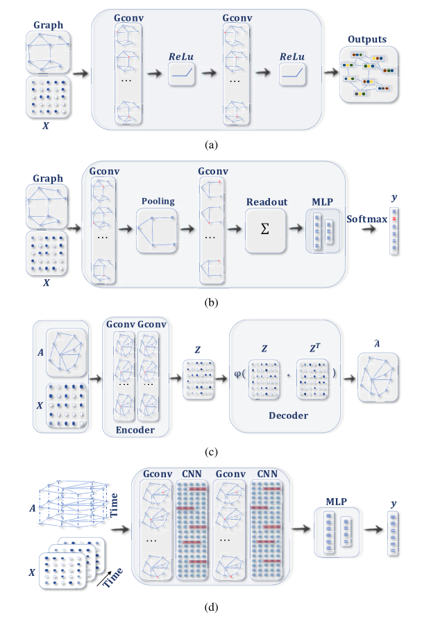

***图2-1 基于图卷积搭建的不同图神经网络模型***[16]

​	从图2-1中我们可以看到，相关图神经网络的模型都离不开一个基本方法——图卷积，图卷积之于图结构数据相当于CNN之于图像，两者的基本思想是相同的，且发展历程也有很大的相似性。第一篇GCN的论文发表于2013年[13], 但是由于其全量卷积的局限性，卷积速度和信息聚合的结果都不如之前的图嵌入算法，所以无法引起学术界的重视，直至4年之后，2017年第二代GCN发表[18]，瞬间“引爆”了图神经网络领域，从2-2图中我们也可以看到自2017年以来，GNN论文发表数量呈指数级增长。

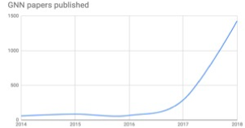

***图2-2 GNN 论文发表数量时间图***

​	GCN（Graph Convolutional Networks）与循环图神经网络密切相关，但是GCN不是用收缩约束来迭代节点状态，而是用固定的层数和每层不同的权重来架构解决循环的相互依赖关系。由于图形卷积与其他神经网络的复合更加有效和方便，近年来，GCN的普及率在迅速提高。

​	GCN分为两类：基于谱域的和基于空域的。基于谱域的方法通过从图信号处理的角度引入滤波器来定义图卷积[19]，其中图卷积操作被解释为去除图信号的噪声。基于空间的方法继承了RecGNNs的思想，通过信息传播来定义图卷积。自从GCN[20]结合了基于频谱的方法和基于空间的方法之间的差距后，基于空间的方法由于其诱人的效率、灵活性及通用性最近得到了快速发展。由于谱域的方法有强大的数学原理支撑，而空域的更类似于计算机工程的思想，仅考虑节点邻居的采样与聚合，对空域算法的改进更多是采样函数和聚合函数的修改，但是谱域的研究则更偏向于数学，其中牵扯到拉普拉斯矩阵、傅里叶变换，谱域卷积是图卷积网络的理论支柱，是图卷积网络的可解释性，特别是，一些基于谱域的图卷积可以被看作是空域卷积的基础，所以科研者对谱域图卷积的探索也未曾停止。

### 谱域图卷积

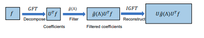

***图2-3 谱域图卷积过程***‘

​	如图2-3所示，图谱域卷积的思想是调制图信号的频率，使得其中一些频率分量被保留或者放大，而另一些频率的分量被移除或者减少。因此给定一个图信号，首先需要对其进行图的傅里叶变换(Graph Fourier Transform, GFT)，以获得它的图傅里叶系数，然后对这些系数进行调制，再在空域中重构该信号。

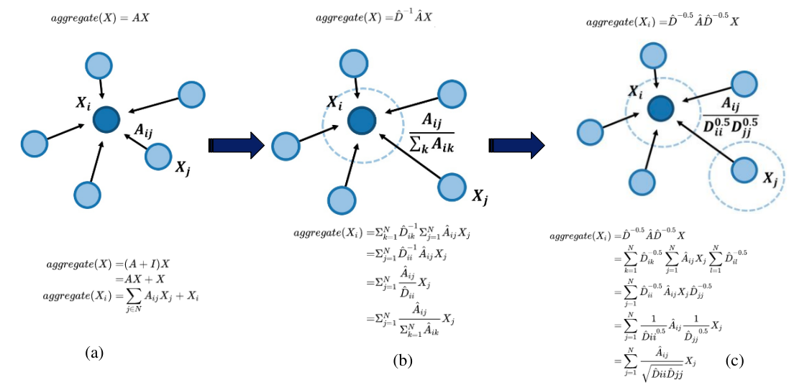

***图2-4 拉普拉斯矩阵***

​	其中***U***表示由图***G***的拉普拉斯矩阵的特征向量组成的矩阵，拉普拉斯矩阵的定义如图2-4，其中A是节点的邻接矩阵，D为图的邻接矩阵，图2-4(a)是带自我特征的拉普拉斯矩阵，因为在节点的邻接矩阵A中对角线是0，如果直接与节点的特征矩阵X相乘则会丢失节点自身的信息，所以需要加上一个单位矩阵，但是2-4(a)没有归一化，经过多次卷积之后会出现节点信息爆炸的结果，所以2-4(b)是归一化的拉普拉斯矩阵，2-4(c)是对称归一化的拉普拉斯矩阵，在现在常用的图卷积中2-4(c)使用的比较多。由图2-4的公式易证，3个拉普拉斯矩阵都是满秩的，所以一定可以通过矩阵分解得到特征矩阵U，图结构通过拉普拉斯矩阵和傅里叶变换得到频域的信号，经过卷积过滤信息之后再通过逆拉普拉斯矩阵变换到空域，这就是谱域卷积的过程。

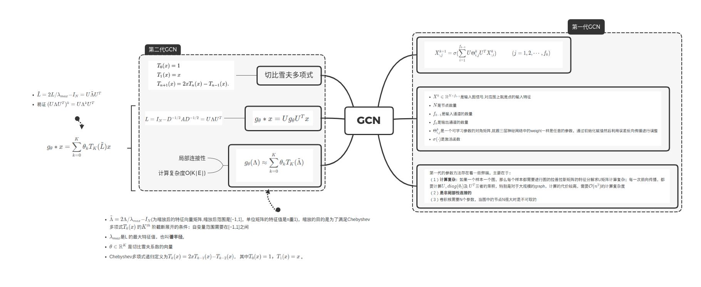

***图2-5 谱域图卷积发展历程*** 

​	2013年发表的第一代GCN存在很多缺陷，计算复杂，非局部连接，且在巨型网络中因为参数的限制具有不可行性，所以一直没有得到很好的普及和应用，2017年发表的第二代GCN利用了切比雪夫等式来简化GCN的计算过程，且只聚合K层的邻居节点，最后GCN演变为一阶切比雪夫的图卷积，经过简化之后，GCN被表示为：

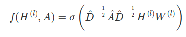

***图2-6 谱域图卷积公式*** 

第二代的GCN是权值共享的，且具有局部性Local Connectivity，也就是局部连接的，因为每次聚合的只是一阶邻居，感受野正比于卷积层层数，第一层的节点只包含与直接相邻节点有关的信息，第二层以后，每个节点还包含相邻节点的相邻节点的信息，这样的话，参与运算的信息就会变多。层数越多，感受野越大，参与运算的信息量越充分。也就是说随着卷积层的增加，从远处邻居的信息也会逐渐聚集过来，同时复杂度大大降低，不用再计算拉普拉斯矩阵，特征分解，所以可以很好的普及到各个应用领域。但是基于谱域的GCN在正常情况下无法处理有向图，并且巨型图中的扩展性较差。

### 空域图卷积

​	信息传递神经网络(MPNNs)概述了基于空间的卷积神经网络的一般框架[21]。它把图卷积看作一个信息传递过程，信息可以沿着边直接从一个节点传递到另一个节点。空域卷积更符合计算机的思维，其绕开了图谱的理论，无需将信号在空域和频域之间转换，直接在空域上进行定义和操作，更加直观和清晰，且没有了图谱理论的限制，定义更加灵活，并且可以应用在有向图中，但是对比谱域方法，缺失了数学理论的支撑。

​	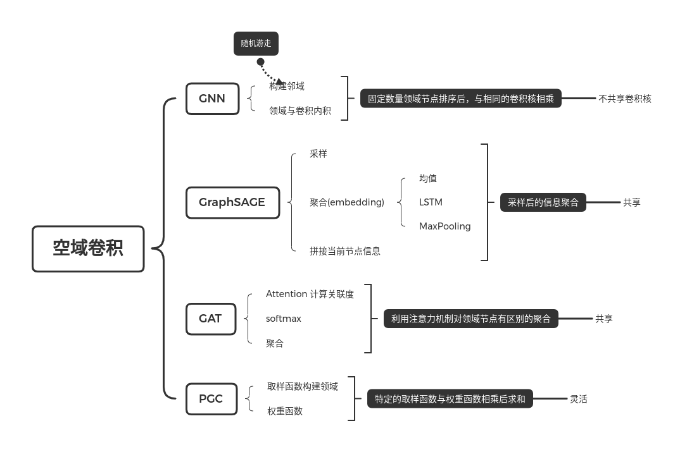

***图2-6 空域图卷积方法*** 

​	在图2-6中罗列了现在常用的空域图卷积模型。空域卷积其实仅需要回答两个问题： 1) 如何确定邻居 ；2）如何与邻居进行聚合。GNN[22]采用随机游走的方式来选取需要聚合的邻居节点，同时邻居节点需要排序，所以图卷积就可以转换成普通的CNN，但是卷积参数不共享；GraphSAGE[23] 采用均匀采样，所以邻居节点不需要排序，同时也实现了参数共享卷积；GAT[24]则是引入了注意力机制，直接采用一阶近邻节点，使用注意力来修正共享的卷积参数；PGC[25]则是定义了一个抽象的采样和聚合的算法。同时GNN、GraphSAGE、GAT不需要训练集和测试集的图结构需要相同，PSG则是要考虑具体的采样和聚合函数。

## 体会与思考

### 1. GNN的模型深度与可扩展性

​	深度学习的成功在于深度神经结构[26]。然而，这篇论文[27]表明，随着图卷积层数量的增加，ConvGNN的性能急剧下降。由于图卷积会使相邻节点的表征更加接近，理论上，如果有无限多的图卷积层，所有节点的表征将收敛到一个点[27]，这种现象与CNN类似。这就提出了一个问题：对于学习图数据来说，深层网络结构是否仍然是一个好的策略。不同于CNN可以通过堆叠非常多层数的神经网络来取得更好的模型表现，因为现在图片的数据像素特别多，但是图结构数据大多不会很大，想象一下上亿像素的图片和上亿节点的图结构，明显前者是普遍存在，而后者是很难获取批量的上亿节点的图结构数据的，且邻接矩阵和上亿节点特征的存储也是不可想象的，同时，图结构比图像的集聚系数更大，如课程中提到的小世界网络，在这种网络中大部分的结点不与彼此邻接，但大部分结点可以从任一其他点经少数几步（如6跳）就可到达（若将一个小世界网络中的点代表一个人，而连结线代表人与人认识，则这小世界网络可以反映陌生人由彼此共同认识的人而连结的小世界现象），所以普通GNN会比CNN聚合节点的信息更快。

​	因此图神经网络从提出后，大部分图神经网络仅仅堆叠两层就能够在下游任务上取得较好的效果。当网络层数加深时，按照常见的解释，会发生过平滑或者过压缩现象，导致不同节点之间的区分度和节点自身的特征表达下降，从而使得深层的图神经网络效果反而不如浅层网络。但鉴于CV和NLP中的相关经验，浅层网络对数据的拟合能力会弱一些，因此对如何构建深层图神经网络的探索从未停止，例如深层图神经网络GCNII[28]在Cora/PPI等数据集，RevGEN在ogbn-proteins数据集上都取得了state-of-art的结果，我们仍然能看到深层图神经网络未来的潜力。

​	GNN的可扩展性是以破坏图的完整性为代价获得的。无论是使用抽样还是聚类，模型都会失去部分图的信息。通过抽样，一个节点可能会错过其有影响力的邻居。通过聚类，一个图可能被剥夺了一个独特的结构模式。如何权衡算法的可扩展性和图的完整性可能是一个未来的研究方向。

### 2. GNN与网络科学融合

​	网络科学的发展与完善让我们在刻画复杂网络结构的统计特性上提出了许多概念和方法，并且还利用了很多统计物理中的知识来描述网络，在这些统计特性中，度分布、聚类系数、平均路径长度是网络中非常重要的描述子。

​	现在的GCN在进行谱域分解时，会用到度矩阵来对邻接矩阵做归一化，我同时也注意到聚类系数C与 节点的度定义较为类似，且聚类系数还会注意节点邻居的度，这与拉普拉斯矩阵的对称归一化有“异曲同工”之妙。

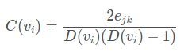

***图3-1 图聚类系统定义***

​	我思考是否能将归一化的度矩阵替换成聚类系数矩阵，直接代入GCN的公式，但是度矩阵在后期算节点信息聚合时可以拆分，用来简化计算，且计算聚类系数矩阵会比计算度矩阵更耗时。

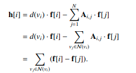

***图3-2 GCN节点信息聚合***

​	我认为在图神经网络中应用复杂网络科学的知识是必然，无论是提出新的方法还是优化现有的算法，网络科学知识对图神经网络都有指导性的意义，并且图神经网络出现的很多问题（如卷积平滑）在复杂网络科学中也被研究过，如何将网络科学的知识迁移到图神经网络中来我认为是一个非常值得研究的问题。

### 3. GNN与时序演化网络结合

​	实际网络的一个重要特征是网络结构是随时间演化的，许多网络在总体上呈现出规模不断增大的趋势。即图在本质上是动态的，节点或边可能会出现或消失，节点/边的输入可能会随时间而改变。需要新的图形卷积来适应图形的动态性。尽管STGNNs可以部分解决图的动态性问题，但很少有STGNNs考虑如何在动态空间关系的情况下进行图的卷积。

​	在网络演化中，网络的传播是最为普遍的，如流行病传播、社会网络中的信息传播和电力网络中的故障传播。网络科学中有经典的SI、SIR、SIS等传染模型来推演网络的时序演化，这也给图神经网络打开了一扇窗，是否可以通过传染模型和图神经网络结合来预测网络的演化、这是非常有现实意义的。

### 4. GNN在异质图中的应用

​	目前大多数的GNN都是假设同质图的。很难将当前的GNN直接应用于异质图，因为异质图可能包含不同类型的节点和边，或者不同形式的节点和边输入，如图像和文本，因此，应该开发新的方法来处理异质图，同时我们也可以借鉴网络科学中对异质图的处理方法来寻求图神经网络中新的研究方向。

## 参考文献

[1] J. Redmon, S. Divvala, R. Girshick, and A. Farhadi, “You only look once: Unified, real-time object detection,” in Proc. IEEE Conf. Comput.
Vis. Pattern Recognit. (CVPR), Jun. 2016, pp. 779–788.

[2] S. Ren, K. He, R. Girshick, and J. Sun, “Faster R-CNN: Towards realtime object detection with region proposal networks,” in Proc. NIPS, 2015, pp. 91–99.

[3] T. Luong, H. Pham, and C. D. Manning, “Effective approaches to attention-based neural machine translation,” in Proc. Conf. Empirical Methods Natural Lang. Process., 2015, pp. 1412–1421.

[4] Y. Wu et al., “Google’s neural machine translation system: Bridging the gap between human and machine translation,” 2016, arXiv:1609.08144.
[Online]. Available: http://arxiv.org/abs/1609.08144

[5] G. Hinton et al., “Deep neural networks for acoustic modeling in speech recognition: The shared views of four research groups,” IEEE Signal Process. Mag., vol. 29, no. 6, pp. 82–97, Nov. 2012.

[6] Y. LeCun and Y. Bengio, “Convolutional networks for images, speech, and time series,” in The Handbook of Brain Theory and Neural Networks, vol. 3361, no. 10. Cambridge, MA, USA: MIT Press, 1995.

[7] S. Hochreiter and J. Schmidhuber, “Long short-term memory,” Neural Comput., vol. 9, no. 8, pp. 1735–1780, 1997.

[8] P. Vincent, H. Larochelle, I. Lajoie, Y. Bengio, and P.-A. Manzagol, “Stacked denoising autoencoders: Learning useful representations in a deep network with a local denoising criterion,” J. Mach. Learn. Res., vol. 11, no. 12, pp. 3371–3408, Dec. 2010.

[9] M. M. Bronstein, J. Bruna, Y. LeCun, A. Szlam, and P. Van der Gheynst, “Geometric deep learning: Going beyond Euclidean data,” IEEE Signal Process. Mag., vol. 34, no. 4, pp. 18–42, Jul. 2017.

[10] Darmochwał A. The Euclidean space[J]. Formalized Mathematics, 1991, 2(4): 599-603.

[11] Kakutani S. Some characterizations of Euclidean space[C]//Japanese journal of mathematics: transactions and abstracts. The Mathematical Society of Japan, 1940, 16: 93-97.

[12] Gray J. Ideas of space-Euclidean, non-Euclidean, and relativistic[M]. 1989.

[13] Y. Li, R. Yu, C. Shahabi, and Y. Liu, “Diffusion convolutional recurrent neural network: Data-driven traffic forecasting,” in Proc. ICLR, 2018, pp. 1–16.

[14] A. Jain, A. R. Zamir, S. Savarese, and A. Saxena, “Structural-RNN: Deep learning on spatio-temporal graphs,” in Proc. IEEE Conf. Com-put. Vis. Pattern Recognit. (CVPR), Jun. 2016, pp. 5308–5317.

[15] S. Yan, Y. Xiong, and D. Lin, “Spatial temporal graph convolutional networks for skeleton-based action recognition,” in Proc. AAAI, 2018, pp. 1–9.

[16] Wu Z, Pan S, Chen F, et al. A comprehensive survey on graph neural networks[J]. IEEE transactions on neural networks and learning systems, 2020, 32(1): 4-24.

[17] Bruna J, Zaremba W, Szlam A, et al. Spectral networks and locally connected networks on graphs[J]. arXiv preprint arXiv:1312.6203, 2013.

[18] Defferrard M, Bresson X, Vandergheynst P. Convolutional neural networks on graphs with fast localized spectral filtering[J]. Advances in neural information processing systems, 2016, 29: 3844-3852.

[19] D. I. Shuman, S. K. Narang, P. Frossard, A. Ortega, and P. Van der Gheynst, “The emerging field of signal processing on graphs: Extending high-dimensional data analysis to networks and other irregular domains,” IEEE Signal Process. Mag., vol. 30, no. 3, pp. 83–98, May 2013.

[20] Kipf T N, Welling M. Semi-supervised classification with graph convolutional networks[J]. arXiv preprint arXiv:1609.02907, 2016.

[21] Gilmer J, Schoenholz S S, Riley P F, et al. Neural message passing for quantum chemistry[C]//International conference on machine learning. PMLR, 2017: 1263-1272.

[22] Scarselli F, Gori M, Tsoi A C, et al. The graph neural network model[J]. IEEE transactions on neural networks, 2008, 20(1): 61-80.

[23] W. Hamilton, Z. Ying, and J. Leskovec, “Inductive representation learning on large graphs,” in Proc. NIPS, 2017, pp. 1024–1034.

[24] Veličković P, Cucurull G, Casanova A, et al. Graph attention networks[J]. arXiv preprint arXiv:1710.10903, 2017.

[25] D. V. Tran, N. Navarin, and A. Sperduti, “On filter size in graph convolutional networks,” in Proc. IEEE Symp. Ser. Comput. Intell. (SSCI), Nov. 2018, pp. 1534–1541.

[26] K. He, X. Zhang, S. Ren, and J. Sun, “Deep residual learning for image recognition,” in *Proc. IEEE Conf. Comput. Vis. Pattern Recognit. (CVPR)*, Jun. 2016, pp. 770–778.

[27] Q. Li, Z. Han, and X.-M. Wu, “Deeper insights into graph convolutional networks for semi-supervised learning,” in Proc. AAAI, 2018, pp. 1–8.

[28] Chen M, Wei Z, Huang Z, et al. Simple and deep graph convolutional networks[C]//International Conference on Machine Learning. PMLR, 2020: 1725-1735.

### 

