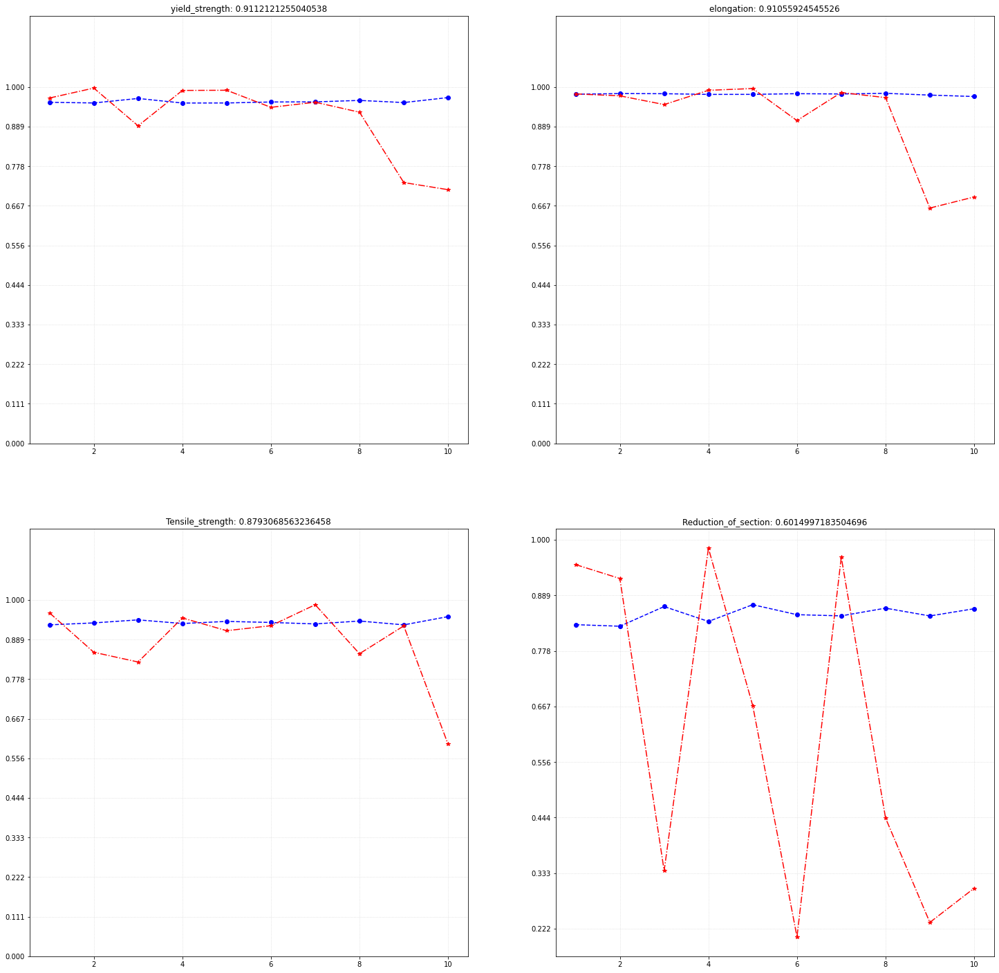

## 疲劳数据报告

### **1.** 疲劳数据预处理

​	疲劳数据在成分维度和目标维度的数据已是浮点型，可直接用于机器学习输入，但其他元素、熔炼和热处理等特征列采用自然语言描述，不能直接作为机器学习的特征列输入，需要特殊处理；并且成分特征列的差距特别小，不利于梯度的反向传递，会导致机器学习效果骤降，所以也需要预处理。

#### 1.1 表格数据读入

​	成分维度的特征列和目标维度的目标列都是浮点输入，可以直接使用pandas读入；其他列中只包含Cu和Al成分，采用正则式分离元素，建立Cu和Al的特征列；熔炼方式、热加工方式、热处理工艺、两种热处理状态的特征了因采用自然语言描述的方式，所以采用编码的方式将其转换成整型特征列输入，下图是全部特征列转换成数字型后绘制的直方图，展示了数据的分布情况：

​	从上图中我们可以看到，成分的分布都比较分散，而且中间空隙较大，这是因为数据中相同材料牌号和炉批号的数据都有非常相近的成分，这就导致数据的连续性变差，机器学习会学到离散地将材料分类，但是经过对目标列的观察，相同材料牌号的预测目标值也是几乎一模一样。

#### 1.2 特征列数据预处理

成分维度的特征值的差距特别小，而且数值也大多在(0,1)之间，但是用自然语言描述的特征列（如热处理方式、熔炼方式）的值会达到4，5较大的值，尽管成分特征列维度和热处理特征列维度之比为11:5，但是在相同学习效率之下，越大的值会产生更大的梯度，会导致成分维度的影响“比重”下降，所以我对成分特征列进行了log正态化：

​	将(0,1)之间的成份值扩大，大于1的成分值降低到1附近，同时将工艺的值进行采用下面的公式线性缩放:

​	得到的值在(-1,1)之间，于成分特征列的值相近，提升成分特征列的影响“比重”，下图是全图特征列经过预处理之后绘制的直方图：

​	可以观察到特征列的数据分布没有被打乱，但是成分特征列的值大都被限制在(0,1)之间，处理工艺特征列被限制在(-1,1)之间。

### 2 神经网络模型训练

#### 2.1 神经网络参数

​	使用pytorch搭建,神经网络参数：

-  学习效率：0.001
- 总训练步数：5000
- 回合数：10
- 隐藏层神经元数量：[32, 16, 8] (全连接)

同时采用sklearn模块的KFold模块进行十字交叉验证，以提高模型的准确率，因为数据量只有81条，一共分10回合，每回合的测试集有8条数据，每回合训练后输出回合的R2和RMSE，训练结束后绘制R2的曲线图作为实验结果输出。

#### 2.2 NN 实验结果

​	断面收缩率的R2波动较大，这是因为断面收缩率的目标值中有一行为NAN，经过自动填充后变成了0，应该是材料测试时没有做实验导致数据的空缺，所以一旦0值在Test集中就会导致R2的极大波动，0值在Train集中就会导致学习loss的巨大波动，导致模型抖动，学习效果变得很差，需要更多的数据将误传递的梯度纠正。

### 3. 异常点去除模型

####  1.1 OneClassSVM

一分类SVM

基本思想：
确定一个超球体，使得球尽可能小，而又包含了尽可能多的点

参数：
    'kernel' : "rbf",
    'gamma' : 'scale',
    'nu' : 0.15,
    'degree' : 3

#### 1.2 IsolationForest

孤立森林

基本思想：
N棵二叉树，每棵树选取部分/全部数据，每次随机选取一个特征，随机选取一个切点(max和min之间)，直到每个/相同点分配到叶子，得到每个点的路径距离d(跟到叶子结点)，N棵树的d的均值即为点的距离。d越小，越异常(离得远，易被分出来)；d越大，越正常。

参数：
    'contamination' : 0.15,
    'random_state' : 1

#### 1.3. EllipticEnvelope

鲁棒的协方差估计

基本思想：
假设常规数据隐含这一个已知的概率分布。基于这个假设，我们尝试确定数据的形状（边界），也可以将远离边界的样本点定义为异常点。

参数：
    'contamination' : 0.15

#### 1.4 LocalOutlierFactor

局部异常因子检测

基本思想：
局部性由 k 近邻给出，并使用距离估计局部密度，通过将样本的局部密度与其邻居的局部密度进行比较，可以是被密度明显低于其邻居的样本，这些样本就被当作是异常样本点。

参数：
    'n_neighbors' : 35,
    'contamination' : 0.15

#### **去除比例**

参数：*contamination*

测试：0.5~0 间隔0.01 决策树回归

结果：0.27和0.15 附近对于**断面收缩率**lose基本处于0.6-0.7

### 4. 传统机器学习模型

#### 1. 决策树回归

参数：
    'criterion' : "friedman_mse",
    'splitter' : "best"

#### 2. SVM回归

参数：
svm_regressor = {
    'kernel' : "rbf",
    'degree' : 5,
    'gamma' : 'scale',
    'epsilon' : 0.15,
    'C' : 100
}

#### 3. KNN回归

参数：
    'n_neighbors' : 5,
    'weights' : "distance",
    'algorithm' : 'auto'

#### 4. 随机森林

参数：
    'n_estimators' : 10,
    'criterion ' : 'mse',
    'max_features' : 'auto'

#### 5. AdaBoost

参数：
    'base_estimator' : None,
    'n_estimators' : 50,
    'learning_rate' : 1,
    'loss' : 'linear',
    'random_state' : 1

#### 6. GBRT

参数：
    'loss' : 'huber',
    'learning_rate' : 0.5,
    'n_estimators' : 100,
    'subsample' : 1,
    'criterion' : 'friedman_mse',
    'random_state' : 1

#### 7. Bagging

参数：
    'base_estimator' : None,
    'n_estimators' : 100

#### 8. ExtraTree

参数：
    'n_estimators' : 100,
    'criterion' : "mse",

### 5. 实验结果

#### 5.1 SVM_DATA

|                        | 屈服强度 | 延伸率   | 抗拉强度 | 断面收缩率 |
| ---------------------- | -------- | -------- | -------- | ---------- |
| DecisionTreeRegressor  | 0.93     | 0.95     | 0.84     | 0.54       |
| svm_regressor          | 0.95     | **0.98** | 0.87     | 0.63       |
| KNN_regressor          | 0.94     | 0.97     | **0.89** | 0.61       |
| RandomForest_Regressor | 0.95     | 0.87     | **0.89** | **0.69**   |
| AdaBoost_Regressor     | 0.94     | 0.96     | 0.88     | 0.63       |
| GBRT_Regressor         | **0.97** | 0.96     | 0.86     | 0.57       |
| Bagging_Regressor      | 0.96     | **0.98** | 0.89     | 0.67       |
| ExtraTreeRegressor     | 0.96     | **0.98** | 0.89     | 0.68       |

#### 5.2 IsolationForest

|                        | 屈服强度 | 延伸率   | 抗拉强度 | 断面收缩率 |
| ---------------------- | -------- | -------- | -------- | ---------- |
| DecisionTreeRegressor  | 0.92     | 0.91     | 0.81     | 0.62       |
| svm_regressor          | 0.95     | **0.98** | 0.87     | 0.63       |
| KNN_regressor          | 0.94     | 0.97     | 0.89     | 0.61       |
| RandomForest_Regressor | **0.96** | 0.97     | 0.88     | 0.66       |
| AdaBoost_Regressor     | 0.94     | 0.96     | 0.88     | 0.63       |
| GBRT_Regressor         | **0.96** | 0.97     | 0.86     | 0.57       |
| Bagging_Regressor      | 0.95     | **0.98** | 0.89     | 0.65       |
| ExtraTreeRegressor     | **0.96** | **0.98** | **0.90** | **0.70**   |

#### 5.3 EllipticEnvelope

|                        | 屈服强度 | 延伸率   | 抗拉强度 | 断面收缩率 |
| ---------------------- | -------- | -------- | -------- | ---------- |
| DecisionTreeRegressor  | 0.94     | 0.95     | 0.81     | 0.69       |
| svm_regressor          | 0.95     | **0.98** | 0.87     | 0.53       |
| KNN_regressor          | 0.94     | 0.96     | 0.86     | 0.64       |
| RandomForest_Regressor | **0.96** | 0.97     | 0.88     | 0.66       |
| AdaBoost_Regressor     | **0.96** | 0.97     | 0.86     | **0.70**   |
| GBRT_Regressor         | 0.95     | 0.97     | 0.86     | 0.54       |
| Bagging_Regressor      | **0.96** | **0.98** | **0.89** | 0.67       |
| ExtraTreeRegressor     | **0.96** | **0.98** | **0.89** | 0.67       |

#### 5.4 LocalOutlierFactor

|                        | 屈服强度 | 延伸率   | 抗拉强度 | 断面收缩率 |
| ---------------------- | -------- | -------- | -------- | ---------- |
| DecisionTreeRegressor  | 0.92     | 0.96     | 0.84     | 0.62       |
| svm_regressor          | 0.95     | **0.98** | 0.87     | 0.63       |
| KNN_regressor          | 0.94     | 0.97     | 0.89     | 0.61       |
| RandomForest_Regressor | 0.95     | **0.98** | 0.89     | 0.58       |
| AdaBoost_Regressor     | 0.94     | 0.96     | 0.88     | 0.63       |
| GBRT_Regressor         | **0.96** | 0.97     | 0.88     | 0.51       |
| Bagging_Regressor      | **0.96** | **0.98** | 0.89     | 0.67       |
| ExtraTreeRegressor     | **0.96** | **0.98** | **0.90** | **0.69**   |