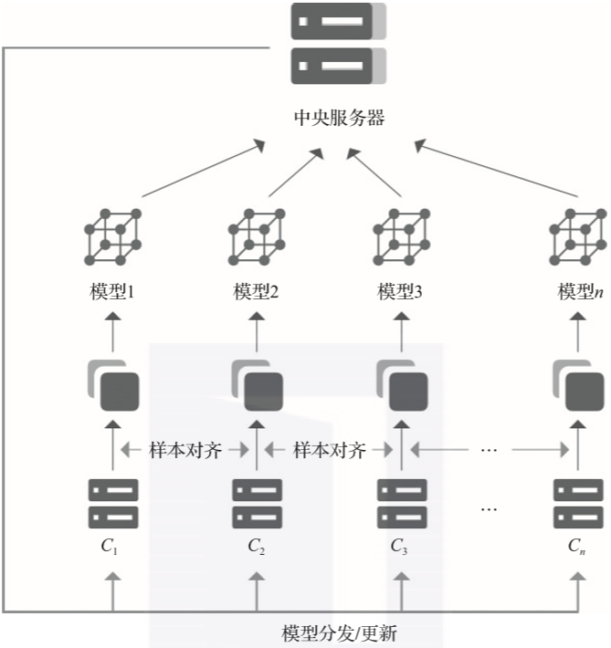
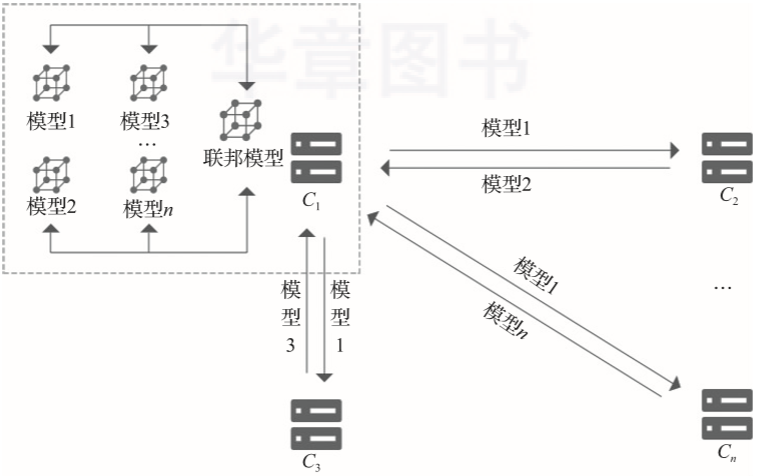
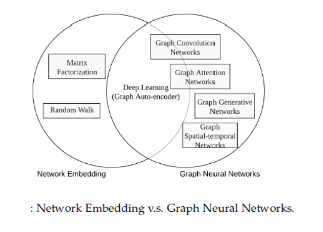
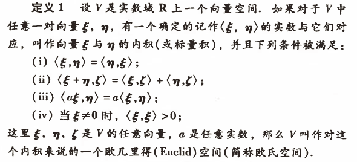

## 研究方向选择——于烨泳

### 1. Federated Learning

#### 1.1 研究背景

​	机器学习三要素之**数据、模型、算法**，基于大数据的机器学习既推动了AI的蓬勃发展，同时也带来了一系列的安全隐私问题。吴恩达，上半年就在MLOps的直播讲座中强调了数据质量比模型调优更为重要和有效。近年来伴随隐私数据导致的各种安全问题，越来越多人开始意识到保障数据安全的重要性，数据隐私已经成为热点问题。2018年欧盟开始执行的《通用数据保护条列》(GDPR)，美国2020年在加利福尼亚颁布的《加利福尼亚州消费者隐私法》(CCPA)，还有我国2017年开始实施的《中华人民共和国网络安全法》都对数据的收集与处理提出了严格的约束和控制要求，今年我国也大力处罚了违法收集数据，传播数据的公司与机构，我国对数据保护的法律也在稳步推进，代表机器学习在数据这一要素的收集需要更加规范。

​	与此同时，机器学习重心正在往数据方向转移，优秀的算法和模型也需要大量的数据支撑，而高质量，大数量的训练数据通常是很难获取的，在某个对数据安全性要求极高的环境下，由于数据具有隐私性（例如医学领域，材料领域，金融领域，政府数据等），无法共享，数据拥有者只允许这些数据保存在自己手中，进而会形成各自孤立的数据孤岛。

​	如何在遵守更加严格的，新的隐私保护条列的前提下，解决数据碎片化和数据隔离的问题，将会是当前人工智能研究者和实践者面临的首要挑战。

#### 1.2 研究现状

​	在计算机及科学与机器学习的发展史中，联邦学习的概念曾多次以不同的形式出现过，如面向隐私保护的机器学习，面向隐私保护的深度学习，协作式机器学习，协作式深度学习，分布式机器学习，分布式深度学习，联邦优化，面向隐私保护的数据分析。

​	2016年谷歌在 arXiv 上提出使用联邦学习技术解决安卓设备模型更新问题，随后2017年-2019年各种基于多方学习的分类回归算法与联邦学习结合。联邦学习的研究工作主要着眼于提升安全性以及统计学上的难题。SecureBoost 方法拥有和无隐私保护方法同等程度的准确度；迁移学习和联邦学习结合允许知识在网络中通过迁移学习进行传输，且不必损害用户隐私；分布式集成于联邦学习，加速模型的训练等等。现在联邦学习已经被应用于计算机视觉领域：医学图像分析；自然语言处理领域：推荐系统。如Google将联邦学习应用于手机键盘的输入预测(Gborad 系统)，这种方法大大提高了智能手机输入法预测的准确度，且不会泄漏用户的隐私数据；Firefox 在预测搜索词上使用了联邦学习。

#### 1.3 概念理解

​	**联邦学习核心: 数据不动，模型动**

联邦学习框架的训练过程可以简单概括为以下步骤：

1. 协调方建立基本模型，并将模型的基本结构与参数告知各参与方；
2. 各参与方利用本地数据进行模型训练，并将结果返回给协调方；
3. 协调方汇总各参与方的模型，构建更精准的全局模型，以整体提升模型性能和效果。

联邦学习通过在训练过程中设计加密式参数传递代替原有的远程数据传输，保证了各方数据的安全与隐私，同时满足了已出台的法律法规对数据安全的要求。

联邦学习架构：

​	1.**中心化联邦**（客户端/服务器）架构

​	2.**去中心化联邦**（对等计算）架构

​	**在对等架构中，由于没有第三方服务器的参与，参与方之间直接交互，需要更多的加解密操作。在整个过程中，所有模型参数的交互都是加密的。目前，可以采用安全多方计算、同态加密等技术实现。全局模型参数的更新可运用联邦平均等聚合算法。当需要对参与方数据进行对齐时，可以采用样本对齐等方案。**

联邦学习分类：

1. 横向联邦学习——样本不同，特征相同（如购物信息）

 	2. 纵向联邦学习——样本相同，特征不同
 	3. 联邦迁移学习——样本和特征重叠都很少

#### 1.4 研究方向思考

* 隐私保护：安全多方计算、同态加密(HTTPS中的对称加密和非对称加密也属于同态加密)和差分隐私——冯师姐觉得安全这块占联邦学习太小，不好研究。
* 联邦学习与贝叶斯优化、遗传算法、简单随机搜索等自动学习超参数的方法结合： 在联邦学习的实际应用中，由于并未提前收集任何训练的数据，几乎不可能为DNN模型设置正确的超参数并设定优化器，所以自动学习超参数的方法与联邦学习相结合是否有前景？(需要超大的算力)
* 分布式联邦学习与强化学习相结合: 强化学习中的A3C算法和分布式的联邦学习有着“异曲同工”之妙，同样是分发训练的参数和整合训练之后的参数；同时传递梯度与传递奖励是否可以互相转换；《联邦学习》书中提到的迁移联邦学习，将经验、知识、参数或梯度迁移到新任务中是目前研究的前沿。
* 联邦学习模型对后门攻击的防御策略：在联邦学习中，假设数据参与方是诚实、半诚实、或是恶意的，联邦学习模型需要防止被恶意的数据所污染（区块链技术——不可变性和可跟踪性？）。
* 联邦学习与边缘计算：联邦计算能使边缘计算设备在不向云服务器发送数据的情况下协作地训练机器学习模型，如Gboard系统。
* 数据的规范化和样本对齐：横向联邦学习急需解决的问题，在对齐样本的同时需要兼顾数据的隐私保护(如何在密文的情况下进行样本对齐？)

### 2. Graph Neural Networks

#### 2.1 研究背景

​	现在正处于深度学习的第三波浪潮，深度学习在图像处理、机器视觉、自然语言处理等领域都取得了重要成果。

在图像处理领域，CNN和图嵌入都有很好的表现。

​	CNN的核心特点在于：局部连接(local connection)，权重共享(shared weights)和多层叠加(multi-layer)。这些特点在图问题中非常适用，**因为图结构是最典型的局部连接结构，其次，共享权重可以减少计算量，另外，多层结构是处理分级模式(hierarchical patterns)的关键。**传统的深度学习方法被应用在提取**欧氏空间**数据的特征方面取得了巨大的成功，但许多实际应用场景中的数据是从非欧式空间生成的，CNN只能在**欧几里德数据(Euclideandata)**，比如二维图片和一维文本数据上进行处理，而这些数据只是图结构的特例而已，对于一般的图结构，则很难使用

​	图嵌入大致可以划分为三个类别：矩阵分解、随机游走和深度学习方法， 图嵌入常⻅模型有DeepWalk，Node2Vec等，然而，这些方法方法有两种严重的缺点，首先就是节点编码中权重未共享，导致权重数量随着节点增多而线性增大，另外就是直接嵌入方法缺乏泛化能力，意味着**无法处理动态图以及泛化到新的图**

​	CNN和图嵌入都无法处理非欧空间中的数据，如社交网络数据、化学图式，引文网络等，图神经网络(GNN)便应运而生。

#### 2.2 研究现状

​	由于图结构的强大表现力，用机器学习方法分析图的研究越来越受到重视。图神经网络（GNN）是一类基于深度学习的处理图域信息的方法。由于其较好的性能和可解释性，GNN 最近已成为一种广泛应用的**图分析方法**。

​	图神经网络大致分类：

1. 图卷积网络(Graph convolution networks)
2. 图注意力网络(graph attention networks)
3. 图的空域网络(spatial-temporal networks)，因为该模型通常用在动态图(dynamic graph)上。
4. 图的自编码(auto-encoder)，因为该模型通常使用无监督学习(unsupervised)的方式。
5. 图生成网络(generative networks)，因为是生成式网络。

#### 2.3 概念理解

1. **欧式空间：**

**欧几里得空间**就是在对**现实空间的规则抽象和推广（从n<=3推广到有限n维空间）**，**在欧几里得几何中，平行线任何位置的间距相等**。几何空间一般是2维，3维（所以，我们讨论余弦值、点间的距离、内积都是在低维空间总结的），如果将这些低维空间所总结的规律推广到有限的n维空间，那这些符合定义的空间则被统称为**欧几里得空间（欧式空间，Euclidean Space）**。

在我们日常生活中，最常见到的媒体介质莫过于是`图片(image)`和`视频(video)`以及`语音(voice)`了，这些数据有一个特点就是：“排列整齐”——对于某个节点，我们很容易可以找出其邻居节点。而且，图片数据天然的，节点和邻居节点有着统计上的相关性，因此能够找出邻居节点意味着可以很容易地定义出卷积这个操作出来，而我们在深度学习的过程中知道，卷积这个操作是提取局部特征以及层次全局特征的利器，因此图片可以很容易定义出卷积操作出来，并且在深度网络中进行进一步操作。而且，因为这类型的数据排列整齐，不同样本之间可以容易的定义出**“距离”**这个概念出来。（图片的距离——假设现在有两个图片样本，尽管其图片大小可能不一致，但是总是可以通过空间下采样的方式将其统一到同一个尺寸的，然后直接逐个像素点进行相减后取得平方和，求得两个样本之间的欧几里德距离是完全可以进行的；同样的，视频可以在时间轴上进行采样做到统一的目的，而音频也是一样的。因此它们都是符合欧几里德距离定义的类型的样本）

***非欧几何**，爱因斯坦曾经形象地说明过：假定存在一种二维扁平智能生物，但它们不是生活在绝对的平面上，而是生活在一个球面上，那么，当它们在小范围研究圆周率的时候，会跟我们一样发现圆周率是3.14159……可是，如果它们画一个很大的圆，去测量圆的周长和半径，就会发现周长小于2πr，圆越大，周长比2πr小得越多，为了能够适用于大范围的研究，它们就必须修正它们的几何方法。如果空间有四维，而我们生活在三维空间中，而这个三维空间在空间的第四个维度中发生了弯曲，我们的几何就会象那个球面上的扁平智能生物一样，感受不到第四维的存在，但我们的几何必须进行修正，这就是非欧几何。在非欧几何中，平行的直线只在局部平行，就象地球的经线只在赤道上平行。*

**非欧几里德结构的样本总得来说有两大类型，分别是图数据和流形数据。**

这两类数据有个特点就是，排列不整齐，比较的随意。具体体现在：**对于数据中的某个点，难以定义出其邻居节点出来，或者是不同节点的邻居节点的数量是不同的**，这样就意味着难以在这类型的数据上定义出和图像等数据上相同的卷积操作出来，而且每个样本的节点排列可能都不同。（比如在生物医学中的分子筛选中，显然这个是一个Graph数据的应用，但是我们都明白，不同的分子结构的原子连接数量，方式可能都是不同的，因此难以定义出其欧几里德距离出来，这个是和我们的欧几里德结构数据明显不同的，**因此这类型的数据不能看成是在欧几里德样本空间中的一个样本点了**，而是要想办法将其嵌入(embed)到合适的欧几里德空间后再进行度量）

**只要是赋范空间中的数据，都可以建立数据节点与数据节点之间的某种关联，都可以尝试用非欧几里德结构数据的深度方法进行实验。**

2. **赋范空间**：

赋范空间是在距离空间中用范数来定义距离。向量空间是一个距离空间，一般距离用欧式距离定义。如果用范数来定义向量空间中欧式距离或其他距离，向量空间也就是一个赋范空间。

3. **GNN**：

GNN是一种连接模型，通过网络中节点之间的信息传递的方式来获取图中的依存关系，GNN通过从节点任意深度的邻居来更新该节点状态，这个状态能够表示状态信息。

#### 2.4 研究方向思考

1. GNN也能在欧式空间建立节点之间的关联，可以应用于普通的机器学习领域，如材料，图像、自然语言等。将GNN与材料项目所结合，探索材料特征的新型表示方式获取更好的学习成果。

2. 图卷积网络（GCN）。图卷积网络将卷积运算从传统数据（例如图像、材料）推广到图数据。其核心思想是学习一个函数映射 ***f(.)***，通过该映射图中的节点 ***vi*** 可以聚合它自己的特征 ***xi*** 与它的邻居特征***xj***来生成节点 ***vi***  的新表示。

3. 图注意力网络。注意力机制如今已经被广泛地应用到了基于序列的任务中，它的优点是能够放大数据中最重要的部分的影响。图神经网络在聚合过程中使用注意力，整合多个模型的输出，并生成面向重要目标的随机行走。

   **3.1 Graph Attention Network (GAT)**

   **3.2 Gated Attention Network (GAAN)**

   **3.3 Graph Attention Model (GAM)**

4. 图自编码器（Graph Autoencoders）。图自动编码器是一类图嵌入方法，其目的是利用神经网络结构将图的顶点表示为低维向量。典型的解决方案是利用多层感知机作为编码器来获取节点嵌入，其中解码器重建节点的邻域统计信息。可以与高维材料数据的降维相结合，得到不损失或损失较小的压缩特征编码器。

5. 图生成网络（Graph Generative Networks）——大多基于GCN。图生成网络的目标是在给定一组观察到的图的情况下生成新的图。图生成网络的许多方法都是特定于领域的。例如，在分子图生成中，一些工作模拟了称为SMILES的分子图的字符串表示。
6. 图时空网络（Graph Spatial-Temporal Networks）。图时空网络同时捕捉时空图的时空相关性，如无人驾驶领域中三维点云数据、雷达数据、相机数据的联合分析与处理。
