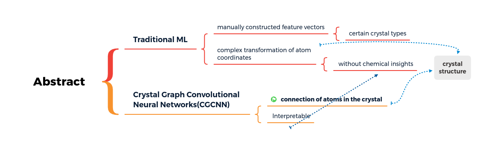
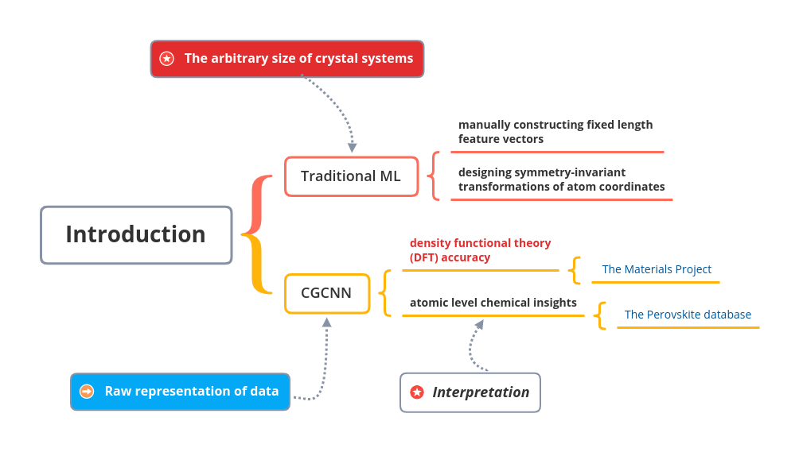
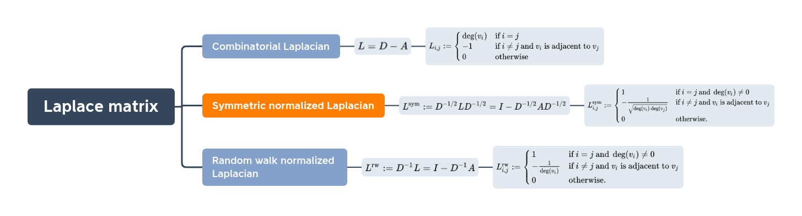
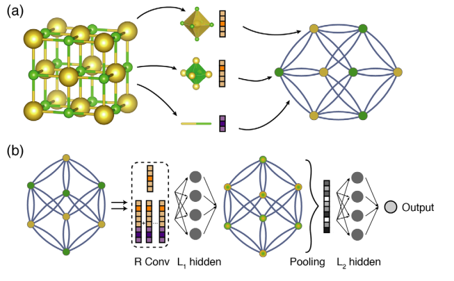
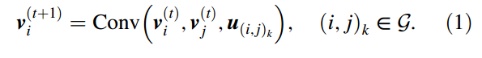
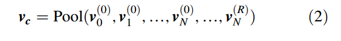
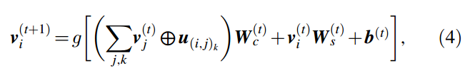
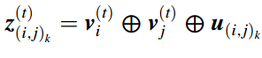
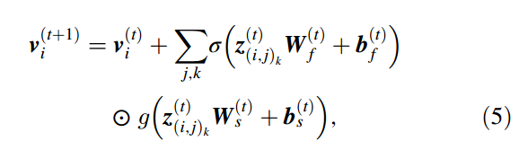

## 2018 PRL Crystal Graph Convolutional Neural Networks

### Abstract

使用机器学习方法加速晶体材料的设计，通常需要手动构建特征向量或复杂的原子坐标变换来输入晶体结构，这要么将模型限制在某些晶体类型，要么难以提供化学洞察力。

一个晶体图卷积神经网络框架，直接从晶体中的原子连接中学习材料特性，为晶体材料提供一个普遍的、可解释的表示

框架是可解释的，因为人们可以提取局部化学环境对全局特性的贡献

### Paragraph 1 - 2

晶体系统的任意性给传统的机器学习带来了挑战，因为它们需要被表示为固定长度的矢量，以便与大多数ML算法兼容.

***Density-functional theory (DFT) is a successful theory to calculate the electronic structure of atoms, molecules, and solids. Its goal is the quantitative understanding of material properties from the fundamental laws of quantum mechanics.***

在用材料项目的数据进行训练后，CGCNN在DFT计算方面取得了与DFT相比对8种不同性质的实验数据相似的准确性，表明了该方法的通用性。

通过从总能量中提取过氧化物结构中每个位点的能量来证明CGCNN的可解释性，这是一个学习局部化学环境对全局属性贡献的例子。

从结果中归纳出的经验法则与发现更稳定的过氧化物的常识一致，可以大大减少高通量筛选的搜索空间。

### Paragraph 3 - 4

使用原子信息和原子之间的相互作用编码

***encodes both atomic information and bonding interactions between atoms***

晶体图虽然是无向图，但是允许同一对末端节点之间有多条边，这是晶体图因其周期性而具有的特征

(a) 晶体图的构建。晶体被转换为图形，节点代表单元格中的原子，边代表原子连接。节点和边的特征是分别对应于晶体中的原子和键的向量

(b) 晶体图之上的卷积神经网络的结构。R卷积层和L1隐藏层建立在每个节点之上，形成了一个新的图，每个节点代表每个原子的局部环境。汇总后，代表整个晶体的向量被连接到L2隐藏层，然后是输出层以提供预测。

“卷积”： 通过一个非线性的图卷积函数卷积v~i~ 附近的点和边来更新v~i~

“池化”：归一化的求和法 ***normalized summation***

### Paragraph 5 - 9 

等式 1 对 模型的表现极其重要

第一次尝试：

对于 i 的每个邻居共享卷积矩阵权重W~c~, 忽略了邻居之间相互作用强度的差异。

第二次:

### Page 4

预测连续的特性 –> softmax 函数和交叉熵损失

对于任何应用于材料科学的ML算法来说，模型的可解释性是一个理想的属性，因为它可以为材料设计提供额外的信息，这可能比简单筛选大量的材料更有价值。

### Summary

综上所述，晶体图卷积神经网络为材料特性预测和设计知识提取提供了一个灵活的机器学习框架。该框架使用大约10^4^个训练数据对具有不同结构类型和成分的无机晶体的八种特性提供了可靠的DFT计算估计。作为知识提取的一个例子，我们将这一方法应用于新的过氧化物材料的设计，并表明从模型中提取的信息与常见的化学见解是一致的，并大大减少了高通量筛选的搜索空间。

### 数据集

The Materials Project database： https://www.materialsproject.org/open 晶体

获取CIF文件: Get https://www.materialsproject.org/rest/v2/materials/mp-12324/vasp/cif?API_KEY=nSJziyd9I8xL9cVIdE8

COD： https://www.crystallography.net/cod/cif/ 晶体

The Perovskite database: https://cmr.fysik.dtu.dk/cubic_perovskites/cubic_perovskites.html 过氧化物

CIF 文件定义: https://en.wikipedia.org/wiki/Crystallographic_Information_File

