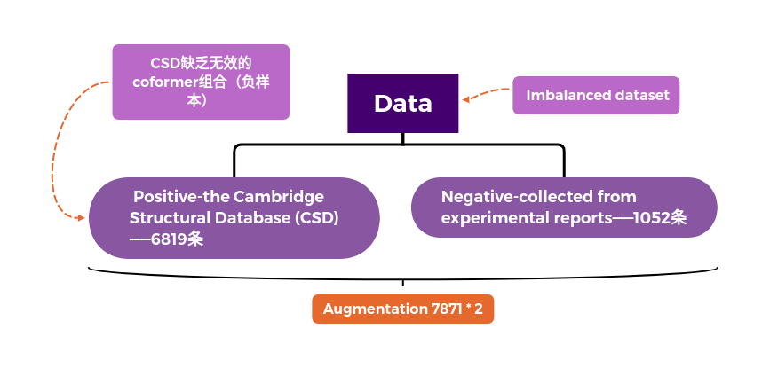

## Co-Crystal graph network (CCGNet)

**共晶体**或**共晶**（英语：cocrystal）是[晶体学](https://zh.wikipedia.org/wiki/晶体学)中的概念，人们对其定义有着争议，一种认为共晶体是由至少两种组分组成的晶体，其组分可以是[原子](https://zh.wikipedia.org/wiki/原子)、[分子](https://zh.wikipedia.org/wiki/分子)或[离子](https://zh.wikipedia.org/wiki/离子)。[[1\]](https://zh.wikipedia.org/zh-hans/共晶体#cite_note-1)另一种认为共晶体是由至少两种组分组成的、具有独特性质的晶体。[[2\]](https://zh.wikipedia.org/zh-hans/共晶体#cite_note-2)也有认为液相合金通过共晶凝固同时结晶出两个固相，这样两相的混合物成为共晶组织或共晶体。

共晶体的组分通过非共价相互作用，如[氢键](https://zh.wikipedia.org/wiki/氢键)、[离子键](https://zh.wikipedia.org/wiki/离子键)、[范德华力](https://zh.wikipedia.org/wiki/范德华力)或[π相互作用](https://zh.wikipedia.org/w/index.php?title=Π相互作用&action=edit&redlink=1)结合。分子间相互作用让晶体产生了和原来各自组分不同的物理及化学性质。

.png)

我们把这些分子描述符从领域知识作为全局状态u，并将其嵌入到一个 2x12的矩阵(因为是两个晶体产生共晶体，所以是2x12。分子图中的共价键信息以邻接关系表示。 每一个片段Al是一个邻接矩阵，代表了一个键。

