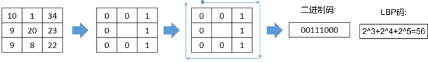
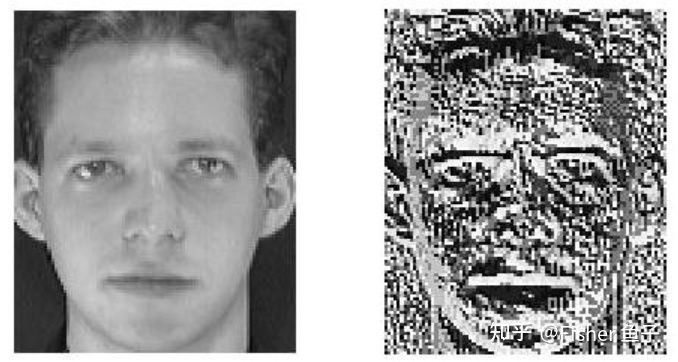
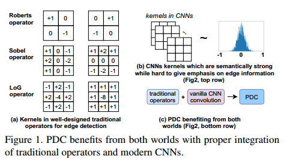
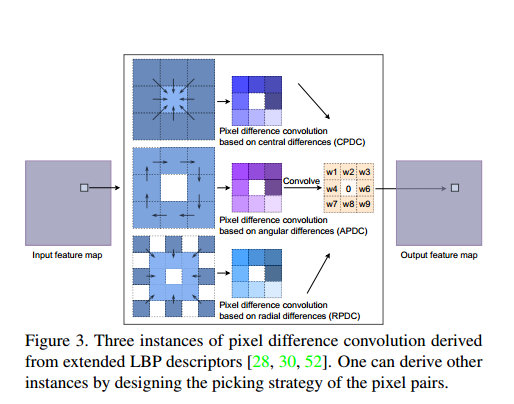
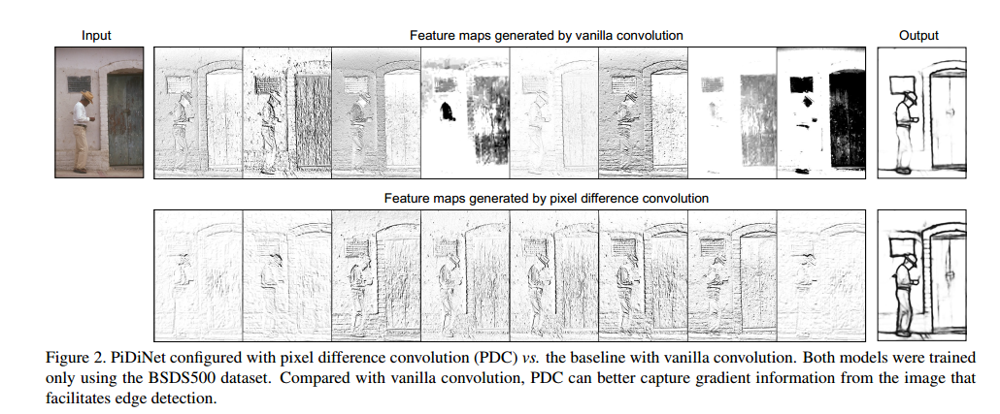
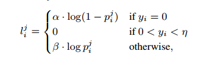

# Pixel Difference Networks for Efficient Edge Detection

​	本文主要介绍由Oulu大学主导的几个**差分卷积（Difference Convolution）**工作及其在图像、视频领域中的应用。 相关工作已被 TPAMI, TIP, CVPR'20, ICCV'21 (Oral), IJCAI'21 等顶级期刊会议接收，并斩获两项国际大赛冠亚军（1st Place in the ChaLearn multi-modal face anti-spoofing attack detection challenge with CVPR 2020 [16] 和 2nd Place on Action Recognition Track of ECCV 2020 VIPriors Challenges [17]）。

## 1. 知乎简单分析

### 1. 鼻祖LBP的简单回顾

​	在传统的手工特征中，比较经典的有Oulu提出的 LBP(Local Binary Patterns)，即局部二值模式 [1]，至今引用已有16000+。最初的LBP是定义在3×3邻域内的，以邻域中心像素为阈值，将相邻的8个像素的灰度值与其进行差分比较，若周围像素值大于中心像素值，则该像素点的位置被标记为1，否则为0。这样，邻域内的8个点经比较可产生8位二进制数（通常转换为十进制数即LBP码，共256种），即得到该邻域中心像素点的LBP值，并用这个值来反映该区域的纹理信息。

用公式表示为：

​	LBP算子运算速度快，同时聚合了邻域内的差分信息，对光照变化较为鲁棒；同时也能较好地描述细粒度的纹理信息，故在早期纹理识别，人脸识别等都被广泛应用。下图为人脸图像在做LBP变换后的LBP码图像，可以看出脸部局部纹理特征较好地被表征：

### 2. 像素差分卷积PDC在边缘检测中的应用

​	在边缘检测中，如下图(a)所示，经典的传统操作子（如Roberts, Sobel和LoG）都采用差分信息来表征边缘上下文的突变及细节特征。但是这些基于手工传统算子的模型往往局限于它的浅层表征能力。另外一方面， CNN通过卷积的深层堆叠，能够有效地捕捉图像的语义特征。在此过程中，卷积核扮演了捕捉局部图像模式的作用。 而如下图(b)所示，Vanilla CNN在对卷积核的初始化过程中并没有显式的梯度编码限制，使其在训练过程中很难聚焦对图像梯度信息的提取，从而影响了边缘预测的精度。

​	为了高效地引入差分操作到CNN中，借鉴于Extended LBP (ELBP) [9]，我们提出了像素差分卷积（Pixel difference convolution, PDC）。根据候选像素对的采样策略，PDC具体分为下图所示三种子形式，其中CPDC类似CDC对邻域特征进行中心差分；而APDC对邻域进行顺时针方向的两两差分；最后RPDC对更大感受野5x5邻域的外环与内环进行差分。

​	文中另外一个贡献是提出了高效转换PDC为VanillaConv的实现及推导证明，即先计算卷积核weights间的difference，接着直接对输入的特征图进行卷积。该tweak不仅可以加速training阶段，而且还可降低在inference阶段的额外差分计算量。以CPDC为例，转换公式如下：

![[公式]](Pixel Difference Networks for Efficient Edge Detection.assets/cdot+x_i.svg)

具体的三种PDC如何组合效果最好，可阅读文章消融实验及分析。最后下图可视化了PiDiNet-Tiny网络配套VanillaConv或者PDC后的特征图及边缘预测。明显的是，使用PDC后，gradient信息的增强有利于更精确的边缘检测。

## 2. 个人论文理解

### 摘要：

​	CNN在边缘检测领域已经接近人类的水平，但是传统的CNN模型达到这样的水平需要预训练和庞大的训练集，并且训练效率低。PiDiNet结合了卷积神经网络和传统的边缘检测算子，并加速了训练和推理效率，在更少参数的情况下获得了最好的效果。

### 引言：

​	前期的传统算子多使用一阶导数和二阶导数来边缘检测，CNN则是作为分类器来输出边缘的概率(Sigmod)，也有CNN和传统算子的结合，但传统的边缘检测算子在一些先前的方法中仅用作提取候选边缘点的辅助工具。pixel difference convolution(PDC)直接使用像素差分的结果用作CNN的输入。因为可用于训练边缘检测模型的注释数据是有限的，因此传统的CNN边缘检测模型需要一个经过良好预训练（通常很大）的主体网络。（VGG16——ImageNet dataset ）。PiDiNet则是一个轻量级的网络且不需要预训练。

### 相关工作

​	使用传统算子来帮助CNN模型边缘检测：使用传统边缘检测算子提取边缘候选点，PDC不依赖于传统算子检测器的边缘信息，而是直接将梯度信息提取过程整合到卷积操作中，这样做更紧凑，更易学习。

​	边缘检测的轻量级网络：先前的轻量级网络在边缘检测的准确率不尽人意，基于多分支的结构可能导致运行效率低下。我们建立了一个骨干结构，它只使用一个简单的edge map作为卷积块的第二分支。

​	与传统边缘检测算子的结合：CDC，LBC（来源与LBP）,与Gabor卷积网络相比PDC的卷积计算更精简。

### PDC

​	ELBP是离散的，PDC在此基础上提出了CPDC，APDC，RPDC，且这三种算子在与卷积的结合的过程中都可以转换成普通的卷积网络计算。

### PiDiNet 网络结构

​	PiDiNet模型小，训练快，且所需数据集小。PiDiNet分为主干网络和侧面网络。侧面网络使用CDCM增强边缘信息，同时使用CSAM消除背景噪声。在edge map使用的Loss函数：

### 实验结果：

​	通过翻转、缩放、旋转来扩大数据集。

## 3. 代码运行

python main.py --model pidinet_converted --config carv4 --sa --dil -j 4 --gpu 0 --savedir /home/yuyouyu/WorkSpace/2021/Graduate_1_autumn/Image_process/pidinet/result_images --datadir /home/yuyouyu/WorkSpace/2021/Graduate_1_autumn/Image_process/pidinet/original_images --dataset Custom --evaluate /home/yuyouyu/WorkSpace/2021/Graduate_1_autumn/Image_process/pidinet/table5_pidinet.tar --evaluate-converted